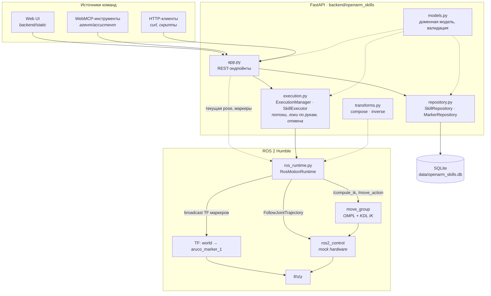
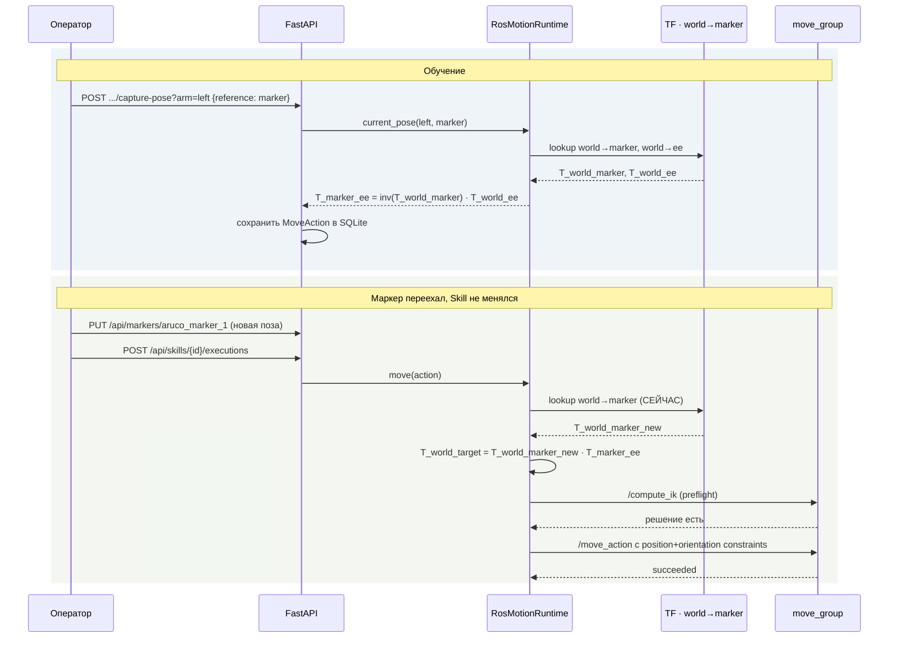

# OpenArm Skill Studio

Конструктор навыков (Skills) для bimanual-робота **OpenArm v2.0** в конфигурации
`default_bimanual`.

Оператор через веб-интерфейс собирает последовательность действий — движения
рук по целевой pose end effector, команды захвата, паузы, одновременные блоки —
сохраняет её как Skill и запускает повторно. Для основного сценария положения
рук хранятся **относительно ArUco-маркера**, поэтому при перемещении маркера тот
же Skill без редактирования отрабатывает в новом месте. Мировая система
координат также доступна как вспомогательный режим для отладки.

```
Web UI ──HTTP──> FastAPI ──rclpy──> MoveIt 2 ──> ros2_control (mock) ──> RViz
                    │
                    └── SQLite (Skills, маркеры)
```

---

## Содержание

- [Быстрый старт](#быстрый-старт)
- [Архитектура](#архитектура)
- [Работа с системами координат](#работа-с-системами-координат)
- [Модель Skill](#модель-skill)
- [API](#api)
- [Ручная проверка](#ручная-проверка)
- [Принятые решения и почему](#принятые-решения-и-почему)
- [Ограничения](#ограничения)
- [Что бы я изменил дальше](#что-бы-я-изменил-дальше)
- [Тесты](#тесты)

---

## Быстрый старт

### Что нужно

- Ubuntu 22.04, **ROS 2 Humble** (`/opt/ros/humble`)
- **Python 3.10+**
- `colcon`, `git`, MoveIt 2 (`ros-humble-moveit`), `ros-humble-ros2-control`,
  `ros-humble-ros2-controllers`, `python3-pytest`

### 1. Исходники ROS и сборка

Пакеты OpenArm подключаются как внешние — в репозитории их нет (меши
`openarm_description` весят около 150 МБ).

```bash
mkdir -p ros2_ws/src
cd ros2_ws/src
git clone https://github.com/enactic/openarm_description.git    # проверено с package version 1.0.0
git clone https://github.com/enactic/openarm_ros2.git           # проверено с package version 0.3.0
cd ../..
./scripts/patch_upstream_moveit.sh
cd ros2_ws
colcon build --symlink-install --parallel-workers 4 \
  --packages-select openarm_description openarm_bimanual_moveit_config openarm_bringup
cd ..
```

Скрипт идемпотентен, накатывает два изменения — RViz-конфиг с TF маркера и
исправление передачи параметров в узел `rviz2`. Оба подробно разобраны в
[Принятые решения](#принятые-решения-и-почему). **Запускать после каждого
переклонирования upstream, затем повторно собирать workspace.**

### 2. Python-окружение

```bash
python3 -m venv --system-site-packages .venv
.venv/bin/pip install -r requirements.txt
```

Флаг `--system-site-packages` нужен, чтобы Python-процесс видел установленные с
ROS 2 модули `rclpy`, `tf2_ros`, сообщения и action-типы.

### 3. Запуск

Терминал 1 — симуляция (MoveIt + mock hardware + RViz):

```bash
./scripts/start_mock_bimanual.sh
```

Терминал 2 — API и веб-интерфейс:

```bash
./scripts/start_api.sh
```

Открыть **http://127.0.0.1:8000**. Проверка здоровья стека — `curl
localhost:8000/health` или `./scripts/check_mock_bimanual.sh`.

---

## Архитектура



### Слои и зачем они разделены

| Модуль | Ответственность | Зависит от ROS |
|---|---|---|
| `models.py` | доменная модель Skill, вся валидация | нет |
| `transforms.py` | кватернионы, `compose`/`inverse` | нет |
| `gripper.py` | перевод `opening` в зеркальные позиции приводов захватов | нет |
| `repository.py` | SQLite: Skills и маркеры, миграции | нет |
| `execution.py` | оркестрация: потоки, локи по рукам, отмена | нет |
| `ros_runtime.py` | MoveIt, TF, контроллеры захвата | да |
| `app.py` | REST, склейка слоёв | нет (импорт ROS ленивый) |

Граница проходит по `MotionRuntime` — `typing.Protocol` с методами `move` и
`gripper`. `execution.py` знает только его, поэтому вся логика последовательного
и параллельного исполнения тестируется без запущенного ROS: в тестах
подставляется `FakeRuntime`. Импорт `ros_runtime` в `app.py` ленивый — CRUD и
UI поднимаются в окружении без ROS (`OPENARM_ROS_ENABLED=0`).

---

## Работа с системами координат

Главное требование задачи: положения рук хранятся **относительно ArUco-маркера**,
а не относительно неподвижного мира.

### Что сохраняется

При захвате позы (`POST /api/skills/{id}/actions/capture-pose`) в Skill пишется
не мировая координата, а трансформация от маркера к end effector:

```
T_marker_ee = inverse(T_world_marker) · T_world_ee
```

### Что происходит при запуске

Мировая цель вычисляется заново, из **текущего** TF маркера, непосредственно
перед планированием:

```
T_world_target = T_world_marker_current · T_marker_ee_saved
```



Ключевое: резолв делается **при исполнении, а не при сохранении**. Если бы
мировая цель вычислялась в момент записи Skill, повторный запуск после
перемещения маркера привёл бы руку в старую точку — то есть требование задачи
было бы нарушено.

Проверено на живом стеке — маркер сдвинут на −0.060 м по Y, Skill не
редактировался:

| | Y маркера | достигнутая поза руки |
|---|---|---|
| запуск 1 | 0.000 | x=0.2358 **y=0.1532** z=0.4605 |
| запуск 2 | −0.060 | x=0.2353 **y=0.0917** z=0.4611 |

Δy = −0.0615 при неизменных X и Z (расхождение 0.0015 м укладывается в
`position_tolerance` = 0.002 м).

### Откуда берётся поза маркера

Маркер публикуется как TF-фрейм `world → aruco_marker_1` из
`RosMotionRuntime` (таймер 20 Гц). Задаётся он через `PUT /api/markers/{frame_id}`
— из UI, curl или любого другого источника. Реального распознавания по
изображению камеры нет, см. [Ограничения](#ограничения).

В Web UI положение маркера вводится как `X/Y/Z` в метрах и
`Roll/Pitch/Yaw` в градусах. Перед отправкой интерфейс преобразует RPY в
нормализованный кватернион, поэтому ROS 2 TF и сохранённая модель данных
остаются в стандартном формате quaternion.

Маркеры **персистентны**: они лежат в SQLite и перевещаются в TF при старте
API. Без этого сохранённый marker-relative Skill ломался бы после каждого
перезапуска, потому что его reference frame просто не существовал бы.

---

## Модель Skill

Skill — дерево действий с версией схемы (`schema_version`), четыре типа:

| Тип | Поля | Смысл |
|---|---|---|
| `move` | `arm`, `target`, `velocity_scale`, `acceleration_scale`, `planning_time`, допуски | движение по целевой pose через IK |
| `gripper` | `arm`, `opening` 0…1, `timeout` | захват; 0 — закрыт, 1 — открыт |
| `wait` | `duration` | пауза |
| `parallel` | `branches[]` | ветви исполняются одновременно |

`target` = `{reference: {kind: world|marker, frame_id}, pose: {position, orientation}}`.
Для `kind: marker` в `pose` лежит `T_marker_ee`, для `kind: world` — мировая
координата.

Ориентация в API и SQLite хранится как нормализованный кватернион. В редакторе
действия `move` оператор работает с понятными углами `Roll/Pitch/Yaw` в
градусах; Web UI автоматически выполняет преобразование в обе стороны.

Для `gripper` значение `opening` не зависит от стороны: `0` всегда означает
закрытый захват, `1` — полностью открытый. ROS-адаптер учитывает зеркальную
кинематику модели: открытая позиция управляющего сустава равна `+0.7854` рад
для левой руки и `−0.7854` рад для правой.

Валидация на pydantic жёсткая и вся в `models.py`:

- кватернионы нормализуются, нулевые и ненормированные отвергаются;
- `world`-reference обязан иметь `frame_id == "world"`, `marker` — наоборот;
- `action_id` уникальны в пределах Skill;
- вложенность `parallel` ограничена пятью уровнями;
- **две ветви одного `parallel` не могут претендовать на одну руку** — конфликт
  ресурса ловится при сохранении, а не в момент исполнения.

### Исполнение

`SkillExecutor` идёт по дереву последовательно; `parallel` раскидывает ветви по
`ThreadPoolExecutor`. Каждая рука — отдельный `threading.Lock`, то есть рука
является ресурсом, а не глобальная блокировка. Отмена (`CancellationToken`)
прорастает во все ветви; при падении одной ветви остальные останавливаются, а
исходная ошибка поднимается наверх.

Чтобы ветви шли одновременно на самом деле, `move_group` используется **только
как планировщик**: цель отправляется с `plan_only`, а полученная траектория
уходит прямо в `/{arm}_joint_trajectory_controller/follow_joint_trajectory`.
Контроллеры у рук разные, поэтому движения перекрываются по-настоящему — замер
на mock-стенде: два одинаковых `move` последовательно 3.70 с, они же в
`parallel` 1.74 с.

Цена такой схемы: каждый план строился в сцене, где вторая рука стоит в своей
стартовой позе, и между собой планы никто не сверяет. Поэтому перед отправкой в
контроллер траектория проверяется против уже едущих рук — обе семплируются на
общих часах (`trajectory_sync.py`), а совмещённые состояния уходят в
`/check_state_validity` с пустым `group_name`: только проверка робота целиком
видит контакт левой с правой. Ветвь с конфликтом падает до старта движения,
сиблинги останавливаются обычной отменой:

```
RuntimeError: right arm trajectory collides with the moving left arm 1.28 s
after its start (openarm_right_ee_base_link against openarm_left_ee_base_link)
```

---

## API

`http://127.0.0.1:8000`, интерактивная схема — `/docs`.

**Skills**

| Метод | Путь | |
|---|---|---|
| `GET` | `/api/skills` | список (`limit`, `offset`) |
| `POST` | `/api/skills` | создать |
| `GET` | `/api/skills/{id}` | получить |
| `PATCH` | `/api/skills/{id}` | изменить |
| `DELETE` | `/api/skills/{id}` | удалить |
| `POST` | `/api/skills/{id}/actions/capture-pose?arm=left` | дописать текущую позу как `move` |

**Исполнение**

| Метод | Путь | |
|---|---|---|
| `POST` | `/api/skills/{id}/executions` | запустить |
| `GET` | `/api/executions` · `/api/executions/{id}` | статус и текущее действие |
| `POST` | `/api/executions/{id}/cancel` | отменить |

**Робот и маркеры**

| Метод | Путь | |
|---|---|---|
| `GET` | `/api/robot/arms/{arm}/pose` | текущая поза (`reference_kind`, `frame_id`) |
| `POST` | `/api/robot/arms/{arm}/nudge` | шаг позиции XYZ или поворота RPY в мировых осях |
| `GET` `PUT` `DELETE` | `/api/markers[/{frame_id}]` | TF маркеров |
| `GET` | `/health` | состояние БД и ROS |

В HTTP API поле `rotation_rpy` команды `nudge` передаётся в радианах. Web UI
показывает градусы и выполняет перевод перед запросом.

---

## Ручная проверка

Предзагруженных Skills нет: все сценарии создаются оператором через Web UI и
сохраняются в SQLite. Ручное позиционирование позволяет выбрать руку, двигать
end effector кнопками `±X/±Y/±Z` с шагом 5–20 мм и поворачивать кнопками
`±Roll/±Pitch/±Yaw` с шагом 1–15°. После позиционирования кнопка «Сохранить
текущую pose в Skill» добавляет действие `move` в выбранной системе координат.

Минимальный **single-arm** сценарий для демонстрации:

1. Опубликовать `aruco_marker_1` и выбрать `marker` при сохранении pose.
2. Собрать `move → move → gripper(close) → wait → move → gripper(open)` для
   одной руки.
3. Сохранить Skill, запустить и наблюдать результат в RViz и панели исполнения.

Минимальный **bimanual** сценарий:

1. Добавить последовательное действие, например `wait` или начальный `move`.
2. Добавить `parallel` с отдельной ветвью для левой и правой руки.
3. В каждой ветви задать marker-relative `move`; при необходимости добавить
   команды захватов.
4. Сохранить и запустить Skill. Одновременное движение выполняют разные
   `JointTrajectoryController` рук.

Проверка marker-relative сценария:

```bash
# 1. запуск
curl -X POST localhost:8000/api/skills/<id>/executions

# 2. переместить маркер на 40 мм по Y, не меняя высоту
curl -X PUT localhost:8000/api/markers/aruco_marker_1 \
  -H 'Content-Type: application/json' \
  -d '{"position":{"x":0.30,"y":-0.04,"z":0.50},"orientation":{"w":1.0}}'

# 3. запустить ТОТ ЖЕ Skill без редактирования
curl -X POST localhost:8000/api/skills/<id>/executions

# 4. убедиться, что рука пришла в новую точку
curl "localhost:8000/api/robot/arms/left/pose"
```

Маркер и оба end effector видны в RViz как оси с подписями — остальные фреймы
робота в конфиге выключены, чтобы сцена читалась.

---

## Принятые решения и почему

**Mock hardware + RViz вместо Gazebo/Isaac Sim.** Задача — работа с системами
координат и конструктор Skills, а не контактная динамика. `ros2_control` с
`mock_components` даёт настоящие контроллеры, настоящий TF и настоящее
исполнение траекторий, но поднимается за секунды и не требует GPU. Физика
захвата при этом не моделируется — предмет нельзя реально взять.

**MoveIt 2 вместо собственной IK.** У OpenArm 7 степеней свободы на руку;
писать свой решатель под избыточную кинематику в рамках задачи неоправданно.
Используется KDL-плагин и планировщик OMPL из upstream-конфигурации.

**Preflight через `/compute_ik` перед `/move_action`.** Сначала проверяется
разрешимость IK, и только потом отправляется цель планировщику. Это даёт
быструю и понятную ошибку «IK failed for left arm» вместо таймаута
планирования на 5+ секунд — заметно приятнее при ручной сборке Skill.

**Цель задаётся position + orientation constraints, а не joint-состоянием.**
Skill остаётся описанием намерения («привести EE вот сюда»), а не снимком углов
суставов; иначе marker-relative логика была бы невозможна в принципе.

**RPY в UI, quaternion внутри.** Оператору удобнее задавать углы в градусах,
но TF и MoveIt используют кватернионы без разрывов на границе ±180°. Поэтому
преобразование выполняется только на границе Web UI, а API, SQLite и
ROS-адаптер работают с нормализованными кватернионами.

**Одинаковый `opening` для зеркальных захватов.** В Skill обе руки используют
единую шкалу `0…1`, а знак позиции управляющего finger joint выбирает
ROS-адаптер. Это скрывает различие диапазонов URDF (`0…+0.7854` слева и
`−0.7854…0` справа) от модели Skill и не позволяет правому захвату двигаться в
неправильную сторону.

**Рука как ресурс с отдельным локом.** Позволяет честно исполнять `parallel`
двумя руками и одновременно гарантирует, что одна рука не получит две команды
сразу. Конфликт ловится ещё на валидации Skill.

**`move_group` — планировщик, а не исполнитель.** Узел обслуживает
`/move_action` из одной mutually exclusive callback-группы и владеет
единственным `TrajectoryExecutionManager`, поэтому цель, которую он же
исполняет, блокирует все остальные на всё время движения — ветви `parallel`
выстраивались в очередь. В логе это видно буквально: «Received request» для
правой руки приходит через 0.3 мс после «Solution was found and executed» для
левой, то есть цель всё движение пролежала в очереди. Альтернатива — общая
группа `both_arms` в SRDF — покрывает лишь частный случай двух одиночных
`move`, тогда как ветвь `parallel` это произвольная последовательность до 100
действий с `gripper` и `wait` внутри. Планирование осталось в MoveIt,
исполнение ушло на контроллеры рук.

**SQLite, а не файлы или полноценная СУБД.** Нужны атомарность, миграции и
запросы; при этом ноль внешних зависимостей и БД — один файл. Миграции
пронумерованы в `SqliteStore.initialize`, схема поднимается с v1 до v2 без
потери данных.

**Runtime — источник истины для маркеров, БД — только для рестарта.** Пока
процесс жив, TF вещает `RosMotionRuntime`; SQLite хранит копию и перевещает её
при старте. Иначе Skills переживали бы перезапуск, а их reference frame — нет.

**Патч вендоренного MoveIt-пакета.** `demo.launch.py` передаёт узлу `rviz2`
весь набор параметров, включая `robot_description_planning` и
`robot_description_kinematics`. MotionPlanning-дисплей переобъявляет эти имена
как строки, ловит конфликт типов, и `loadRobotModel` падает — робот вообще не
отрисовывается, Planning Group пуст. Баг воспроизводится на нетронутом
upstream. Так как `demo.launch.py` не принимает аргумент RViz-конфига, оба
исправления (параметры и TF-дисплей маркера) накатываются скриптом
`patch_upstream_moveit.sh`. `move_group` получает параметры полностью —
планирование и IK не затронуты.

**Команды не только от оператора.** В задаче сказано, что команды могут
приходить из нескольких источников. Поэтому вся логика живёт за HTTP API, а UI
— лишь один из клиентов; `app.js` дополнительно регистрирует WebMCP-инструменты
(`read_openarm_status`, `start_skill_execution`, `nudge_openarm`), так что
агент управляет роботом через ровно тот же API.

---

## Ограничения

Осознанно не сделано или упрощено:

- **ArUco по-настоящему не распознаётся.** Поза маркера задаётся через
  `PUT /api/markers/{frame_id}`, а не вычисляется из изображения камеры. ТЗ
  такой вариант допускает явно. Архитектурно детектор — это ещё один клиент
  того же эндпойнта: нода с камерой и `cv2.aruco` может публиковать позу без
  единой правки в backend.
- **Нет физики.** Mock hardware исполняет траектории идеально: нет коллизий с
  объектами, нет проскальзывания, захват ничего не удерживает.
- **История запусков живёт в памяти.** `ExecutionManager` теряет записи при
  перезапуске API; в SQLite лежат только Skills и маркеры.
- **`max_effort` у захвата не поддержан** — `JointTrajectoryController` не
  принимает усилие, поле валидируется и явно отвергается вместо тихого
  игнорирования.
- **Патч вендоренного пакета не переживает переклонирование** upstream — надо
  заново прогонять `patch_upstream_moveit.sh`.
- **Версии upstream не запинены по commit SHA.** Сборка проверена с package
  versions 1.0.0 (`openarm_description`) и 0.3.0 (`openarm_ros2`), но команды
  клонирования пока берут текущие default branches.
- **Нет аутентификации и авторизации**, API слушает только `127.0.0.1`.
- **В редакторе нет undo** и нет drag-and-drop переупорядочивания — только
  стрелки вверх/вниз.
- **Проверка коллизий рук дискретная.** Траектории семплируются с шагом ~0.1 с
  (до 30 точек на траекторию) — это защита от встречного движения, а не
  доказательство безопасности; между сэмплами ничего не проверяется. Сама
  проверка стоит десятые доли секунды, на которые старт второй руки отстаёт от
  первой.
- **За исполнением следит контроллер, а не MoveIt.** О срыве траектории
  сообщает `JointTrajectoryController` своими path/goal tolerances; MoveIt
  больше не мониторит исполнение и не пересчитывает сцену на лету.
- **Нет E2E-тестов против живого ROS** — покрыты доменная логика, персистентность
  и API с подставным рантаймом; связка с MoveIt проверялась вручную.

## Что бы я изменил дальше

- Добавить **библиотеку именованных позиций**: сохранять и переиспользовать
  pose отдельно от Skills, указывать руку и систему координат, а изменение
  общей позиции автоматически применять ко всем использующим её сценариям.
- Разделить Web UI на отдельные экраны с расширенным функционалом: библиотека
  Skills, редактор последовательности, библиотека позиций, ручное обучение,
  управление ArUco/TF, история запусков и диагностика ROS.
- Реализовать разные типы движения: **PTP** для перемещения между точками в
  пространстве суставов, **LIN** для линейного движения end effector и
  **CIRC** для движения по дуге через промежуточную точку. Тип движения и его
  параметры стали бы частью действия `move`.
- Развернуть **Isaac Sim на отдельном GPU-сервере** как общую среду
  разработки.
  `ROS_DOMAIN_ID`, WebRTC/HTTP-портами, Git-worktree, сценой и каталогом данных.
  Если ресурсов для нескольких экземпляров недостаточно — использовать
  бронирование одного общего сеанса. Доступ к визуализации организовать через
  WebRTC, а весь ROS 2/OpenArm/MoveIt/backend-стек держать рядом с симулятором,
  чтобы не передавать DDS-трафик через нестабильные внешние сети.
- Вынести ArUco-детектор в отдельную ROS-ноду и публиковать TF напрямую, оставив
  `PUT /api/markers` как ручной override для отладки.
- Сохранять историю выполнений в SQLite: кто, когда, какой Skill, чем
  закончилось, на каком действии упал.
- Заменить polling на WebSocket — сейчас UI опрашивает статус исполнения, при
  длинных Skills это заметно.
- Перейти на `moveit_servo` для ручного позиционирования вместо дискретных
  nudge-команд: сейчас каждый шаг — отдельное планирование, что даёт рывки.
- Добавить в Skill условия и ветвления (`if gripper_holding …`) — сейчас модель
  строго линейная плюс `parallel`.
- Поднять стек в Gazebo, чтобы захват предметов стал осмысленным.

---

## Тесты

```bash
./scripts/run_model_tests.sh
```

31 тест: доменная модель и её валидация, трансформации маркера,
последовательное и параллельное исполнение с отменой, конфликт рук в `parallel`,
семплирование и выравнивание траекторий по общему времени, персистентность
Skills и маркеров через перезапуск приложения, CRUD и отдача статики. Отдельно
проверяются зеркальное преобразование `opening` для двух захватов и наличие
RPY-контролов Web UI.

Отдельно, при поднятом стеке — проверка pose-based IK на живом MoveIt:

```bash
./scripts/verify_both_arms_ik.sh
```

## Структура

```
backend/openarm_skills/   доменная модель, репозиторий, исполнение, ROS-адаптер, API
backend/static/           веб-интерфейс (vanilla JS, без сборки)
backend/tests/            pytest
config/openarm_skills.rviz  RViz-конфиг проекта (TF маркера, обзорная камера)
scripts/                  запуск стека, API, тесты и патчи
data/openarm_skills.db    SQLite (создаётся автоматически)
ros2_ws/                  colcon-воркспейс с внешними пакетами OpenArm
```
